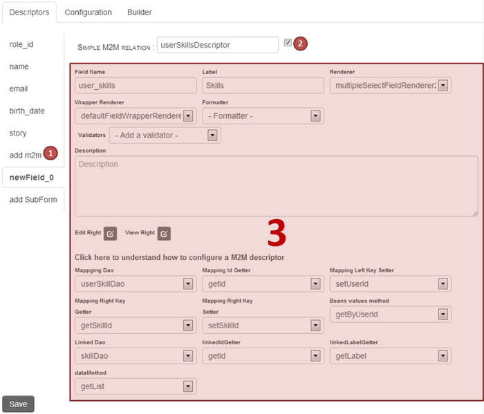
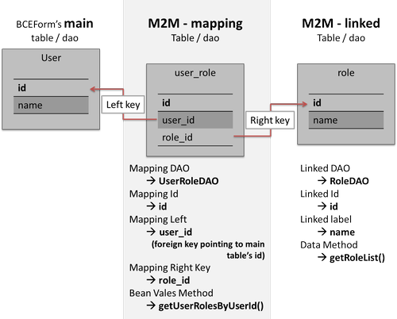
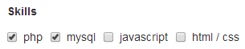
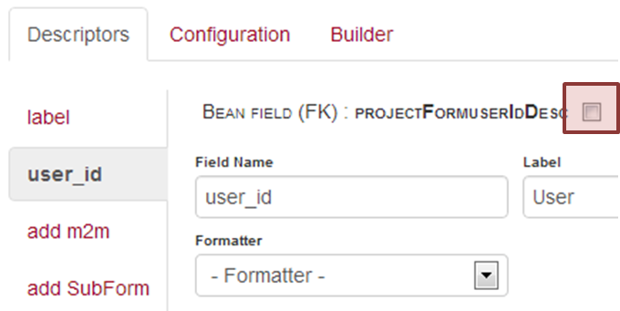
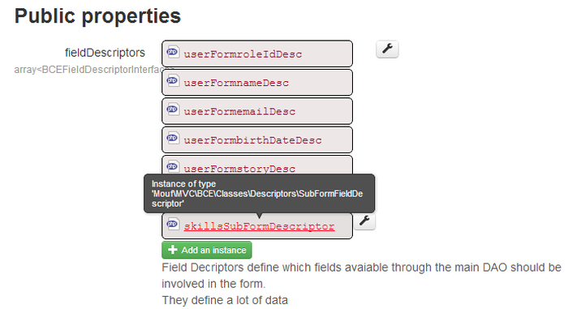
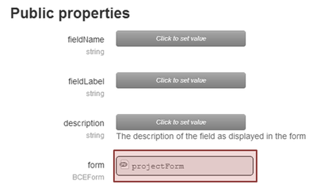
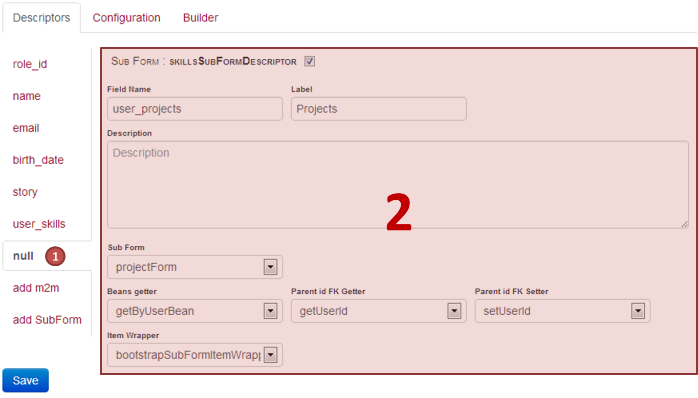
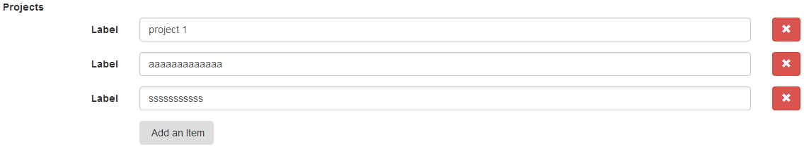

Advanced Fields
==

In the previous chapter (configuring bce forms) we have set up our form to a more convienient display. BCE basically auomatically parses the data model in order to generate base fields (user name, email, etc...) and foreign key fields (user's role) which are, in fact the columns of the user `table`.

But as defined in the quickstart, the user &lt;-&gt; skills & user &lt;- projects relationships are not implemented. In this sections, we will explain how to use the configuration interface in ordre to get a form that handles our data model.

Many to many relationships (M2M)
--

This would apply to the user &lt;-&gt; skills relationship, stored in the user_skill table. Once again very few code is needed : you just have to code a function inside the userSkillDao, that will return all skills mastered by a user :

```php
	/**
	 * Returns a list of UserSkill beans filtered by the specified user id 
	 * @param int $id
	 * @return Test\Dao\Bean\UserSkillBean[]
	 */
	public function getByUserId($id){
		return $this->getListByFilter(new EqualFilter('user_skill', 'user_id', $id));
	}
``` 

Here is how you can quickly configure this type of information using the configuration interface :



First click on the "add m2m" button, the select the new added field, and set the properties...

The base settings of the Field Descriptor are the same - you can refer to the "Field Descriptor Overview" section of the [configure bce form chapter](configure-bce-forms.md). Specific paramaters involve the dao that stores the M2M relation (mapping dao - ie userSkillDao), and the dao that handles the relatied data (linked dao - ie skillDao). For a better understanding, below is a schema that indicates you how to define the specific properties of a M2M field descriptor (just replace the roleDao by the skillDao):



***Note :*** *BCE actually does not allow, handling additionnal data of a many-to-many table. For example, if you want to add a `skill_aquisition_date` column in the `user_skill` table, BCE will not be able to fill it using it's built in field descriptors (anyway, you still can implement your own field descriptor (see [custom field chapter](custom-field.md).*

###Result


That's it :)

Handeling many-to-one relationships
--

This part will explain how to handle the user-projects relationship, but it's quite different than the previous one. As you saw, a M2M fiedDescriptor will produce a checkbox system (other renderings are available, as multi-select, or a set of single selectlists), which means the user forms does not handle skills (nore adding nore creating a skill), which is quite normal because skills are not related to a particular user.

In the user &lt;- projects relationship, this is different : given a project is owned by one user only, that we may want to add or remove a project for a particular user, we will handle projects as an item list in the user form (so called "subforms").

This is done in 3 steps :

1. Create a new BCE Form for projects,
2. Create a SubForm Field Descriptor that will contain the project form,
3. Link and configure this subform in the user form.

> **Important:** When you create your project form, just do not activate the user_id field as it will be handled by BCE internaly :


Then, create a new SubFormFieldDescriptor in the user form (you have to use the default mouf instance view for now), edit this instance (rename it) by setting the form property to the previously generated projectForm.





The only code you have to write here, is a method that returns the list of Project Beans for a given user :
```php
	/**
	 * Returns the list of projects owned by a given user
	 * @param UserBean $user
	 * @return Test\Dao\Bean\ProjectBean[]
	 */
	public function getByUserBean(UserBean $user){
		return $this->getListByFilter($user);
	}
```
***Note :*** *Unlike the many to many function that takes an id in parameter, this one takes the whole bean as input.*

Finaly, you can go back to BCE's configuration interface to finish setting up the SubFormField Descriptor :


* Give the field a **name** (mandatory, and besides it's the reason "null" is written in the left side tab"), and a *label*
* The **sub form** is already set
* The **Beans getter** method is the method you have implemented earlier : getByUserBean
* The **Parent Id FK** is user_id, so select get/setUserId methods
* The default **itemWrapper** to use is the bootstrapSubFormItemWrapper

###Result


Nice isn't it ?

> Next Steps : 

> * Now you know what BCE allows you to do quite quickly, and automatically. If you want to get a technical overview of the BCE library, please read the ["Detailed Architecture"](detailed-architecture.md) chapter.
> * If you need to add a field inside an existing BCE Form, that is not yet implemented inside BCE, you should learn how to ["create a custom field descriptor"](custom-field.md).