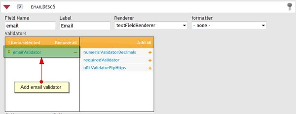
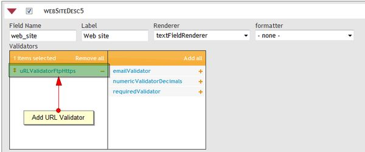
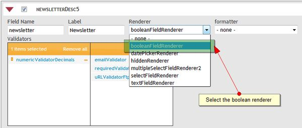
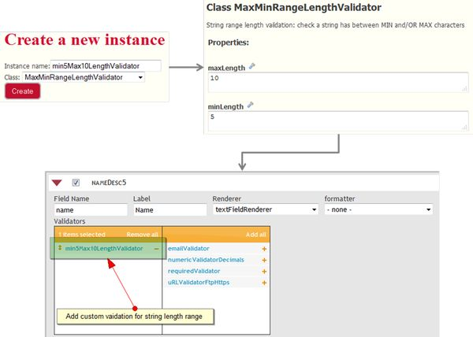
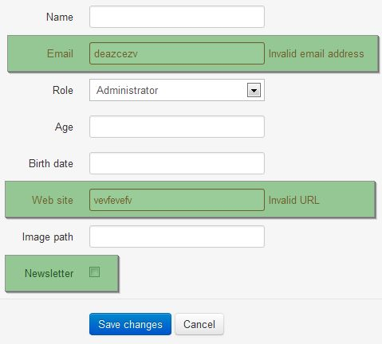
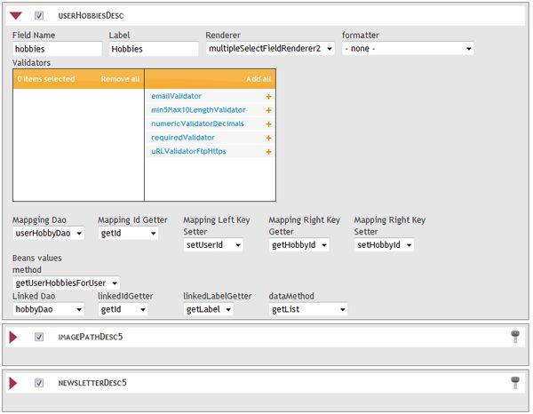
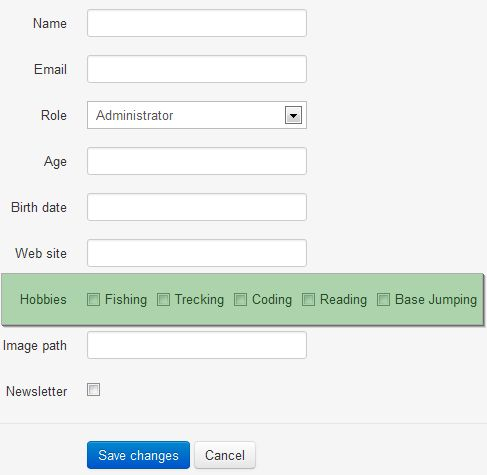
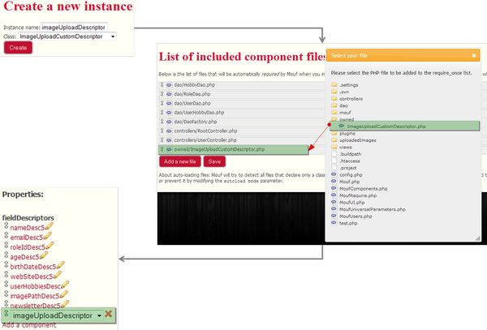
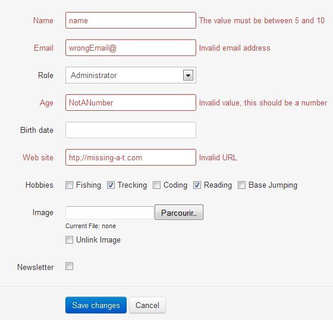

Advanced configuration
======================

In this section, we will see:
- how to fully adapt the field descriptors to their field's types
- then add and configure the user - hobby (Many2Many) Field descriptor
- finally you will get a simple example about coding a custom Field Descriptor

Finalize configuration of the user Form
---------------------------------------

[In the previous chapter](quickstart.md), we left the user form in a simple state:
- almost all fields are rendered as text fields,
- numeric columns are validated as numeric fields,
- role_id column is a dropdown list of roles

This has been made by simply selecting a main DAO, and saving the  efault suggested configuration. Here is a list of configuration settings to give you an idea of what you can achieve...

###Add email validation to the "email" field


###Add URL validation to the "WebSite" field


###Make the "Newsletter" field a checkbox


###Advanced : create and use a new length validator

Let's say we want the name field to be at least 5 chatacters and max 10 characters long. We are going to create a new instance of the MinMaxRangeLengthValidatorn and apply it.



###Result

Now, refresh your "editUser" URL, and see you have a brand new Form!



Set the user - hobby field descriptor
--------------------------------------

As user - hobby is a Many 2 Many relationship, there is no field involved in the user table. Therefore, when you first created the form, no field descriptor was detected and therefore suggested to handle user's hobbies. You can add a Many2ManyField Descriptor by hiting the "+ m2m" button under the "Configuration tab".

Once you do this, a new field descriptor appears at the end of the list. For a better understanding of the Field Descriptors attributes, you should refer to the [detailed description](advanced.md).

After having filled out the descriptor (as you see, the configuration interface assists you in finding DAO's and Bean's methods), you may want to have your "Hobbies" field displayed before ImagePath and Newsletter fields. To do so, just drag the field up.



Now, look at your Form... nice, no?



Create and use your own Field Decsriptor
----------------------------------------

There is always a tiny specific functionnality you have to integrate. When using automated tools as form builders, CMS, ... these tiny things that count for 5% of the application features end up taking 20% of your time which is (I think) very frustrating. In the BCE System, we tried to make it as easy as possible to implement your own field descriptors.
***Note:** Before coding your custom descriptor, remember that as for every plugin of the Mouf framework, contribution is more than welcomed. If you are interested in  (and you have the time for) coding some Field Descriptors, Validators, Renderers, etc... please go ahead and contribute back!*

The first thing to do is creating a class that implements the BCEFieldDescriptorInterace:

```php
/**
 * Returns the name of the field as a unique identifier of that field
 */
public function getFieldName();

/**
 * Returns the name of the field as a unique identifier of that field
 */
public function getFieldLabel();

/**
 * Called when initializing the form (loading bean value into decsriptors, getting the validation rules, etc...)
 * @param mixed $bean : the main bean of the form
 * @param mixed $id : the idenfier of the form
 * @param BCEForm $form : the form itself
 */
public function load($bean, $id = null, &$form = null);

/**
 * Function called when rendering the whole Form
 */
public function toHtml();

/**
 * returns the specific JS for the field. 
 * 	- This JS may come from the renderer if any (eg datepicker or slider, multiselect, etc..)
 *  - Or also from the descriptor itself : eg a file upload callback function
 *  - In case of a custom field, this may also be some validation script
 */
public function getJS();

/**
 * Does all the operations before the main bean is saved. E.G:
 *   - unformat value
 *   - validate value
 *   - set the value on the bean
 *   ...
 *   
 * @param array $post The $_POST
 * @param BCEForm $form the form instance
 */
public function preSave($post, BCEForm &$form);

/**
 * Does some operations after the main bean has been saved.
 * Very important for M2M descriptors in order to perform their own persistance
 * @param mixed $bean the saved bean
 * @param mixed $beanId the id of the saved bean
 */
public function postSave($bean, $beanId);
```

Let's say we want a file upload fiel for our user's image path field.

```php
class ImageUploadCustomDescriptor implements BCEFieldDescriptorInterface{
	
	
	private $fieldName = "cust_image";
	
	/**
	 * Returns the name of the field as a unique identifier of that field
	 */
	public function getFieldName(){
		return $this->fieldName;
	}
	
	/**
	 * Returns the label of the field
	 */
	public function getFieldLabel(){
		return "Image";
	}
	
	/**
	 * (non-PHPdoc)
	 * @see BCEFieldDescriptorInterface::load()
	 */
	public function load($bean, $id = null, &$form = null){
		/* @var $bean UserBean */
		//modify the forms enctype in order to allow file uploads
		$form->setAttribute('enctype', 'multipart/form-data');
		$this->imagePath = $bean->getImagePath();
	}
	
	
	/**
	 * (non-PHPdoc)
	 * @see BCEFieldDescriptorInterface::toHtml()
	 */
	public function toHtml(){
		return "
			<input type='file' value='' name='".$this->fieldName."' id='".$this->fieldName."'/>
			<label style='font-size: 11px;'>Current File: " . ($this->imagePath ? "<a target='_blank' href='". ROOT_URL ."$this->imagePath'>$this->imagePath</a>" : "none") . "</label>
			<label class='checkbox'>
				<input type='checkbox' id='".$this->fieldName."_remove' name='".$this->fieldName."_remove' value='1'>
				Unlink Image
			</label>";
	}
	
	/**
	 * (non-PHPdoc)
	 * @see BCEFieldDescriptorInterface::getJS()
	 */
	public function getJS(){
		//NO JS needed
		return array();
	}
	
	
	/**
	 * (non-PHPdoc)
	 * @see BCEFieldDescriptorInterface::preSave()
	 */
	public function preSave($post, BCEForm &$form){
		/* @var $user UserBean */
		$user = $form->baseBean; 
		$tmpImageData = $_FILES[$this->fieldName];
		
		//New image has been uploaded
		if (!empty($tmpImageData['name'])){
			$filePath = $this->getDestinationFilePath($tmpImageData['name']);
			if (move_uploaded_file($tmpImageData['tmp_name'], ROOT_PATH . $filePath)){
				$user->setImagePath($filePath);
			}else{
				$form->addError($this->fieldName, "Could'nt move uploaded file");
			}
		}
		//Image must be cleared
		else{
			if (isset($post[$this->fieldName."_remove"])){
				unlink(ROOT_PATH . $user->getImagePath());
				$user->setImagePath(null);
			}
		}
	}
	
	/**
	 * Helper to get a filename that is unique: if a file with name $fileName alreday exists, then the value returned will be $fileNameX where X >= 2 and $fileNameX does not exists
	 * @param string $fileName the original filename
	 * @return string the final file name
	 */
	public function getDestinationFilePath($fileName){
		$finalPath = "uploadedImages/" . $fileName;
		$i = 2;
		while (file_exists(ROOT_PATH . $finalPath)) {
			$finalPath = "uploadedImages/" . $fileName . $i;
			$i ++;
		}
		return $finalPath;
	}
	
	/**
	 * (non-PHPdoc)
	 * @see BCEFieldDescriptorInterface::postSave()
	 */
	public function postSave($bean, $beanId){
		//No POST SAVE behavior
		return;
	}
	
}
```

Now, the next thing to do is :

- Include the file in mouf (use include php files),
- Create an instance of the ImageUploadCustomDescriptor class,
- Add the instance to your form. Unfortunately, this is not possible in the configuration interface. You have to swicth back to the classic instance page of the form, and add the field descriptor there.
- Then, you can go back to the configuration interface, and de-activate the default image path descriptor (of course, you could have done this in the default instance view).

###Final result !
