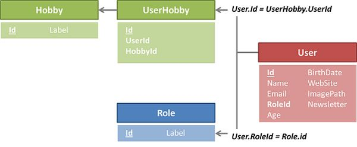
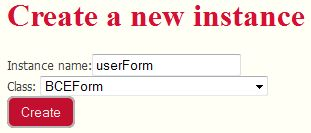
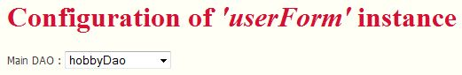
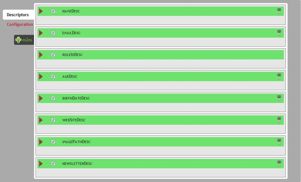
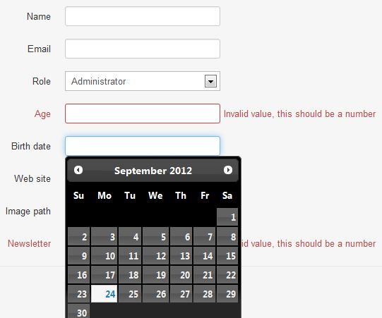

Quick start guide
==================

In this quick start guide, we will see how you can use BCE to build a user form

Our playground data model
-------------------------

The first thing you have to know, is that BCE directy relies on your application's ORM system. For now, Mouf's ORM system is TDBM, but when others will be available, we will do our best to provide multi-ORM support. You will find a detailed description of BCE's architecture in the [dedicated chapter](advanced.md).

For this tutorial, we assume you have Mouf setup, with TDBM and BCE packages installed. We will work on a very classic database schema for handling users.<br/>
We have users. Users have some basic attributes as name, email, etc..., and they have a role defined by a foreign key named role_id. Finally, a user may have some Hobbies, which is represented by a many to many relation using a pivot table.



Create the basic user form
--------------------------

First thing you have to do is creating a BCEForm instance. The BCEForm class represents a form. This is done, as usual, by hiting the "create a new instance" link of the ribbon menu. For example, we create a userForm instance :



Once you've done this, you reach the dedicated configuration interface of BCE that embeds a lot of helpfull functionnalities. A "view properties" link in the left menu will get you back to the classic instance page).



The first thing to do is to select a DAO. We will select the "userDao". As soon as you have chosen your DAO, the interface will suggest the detected field descriptors.

***Notes:***

- The detected fields are the ones that map getters and setters of the bean handled by the dao you selected, which means basically all columns that are located IN the (user) table. If we have a look back to the Data Model defined previously, all fields will be detected. The role_id field will be automatically set as a "ForeignKey" Field Descriptor (see PHP Documentation for a detailed description of the ForeignKeyFieldDescriptor Class). The only thing that BCE cannot guess is the "hobbies" many to many relationship.
- Any time you will access the form configuration interface, you will be suggested a FieldDescriptor for each field that doesn't seem to be handled already. These fields will appear with a green outline, whereas existing ones have a white one. By default, when you create the form, all "suggested" fields are checked to be created.



Save and use the user form
---------------------------
For this quickstart, we will not go further, just so you know how quick it is to get a basic user form. So, in fact, you just created a BCEform instance, selected the DAO that handles your main object, and have written about 0 lines of code... Now please click the save button.

###Write a simple controller
We will assume, you already now about splash and its MVC implementation. I not, please refer to [Splash documentation](https://raw.github.com/thecodingmachine/mcv.splash/4.0/README.md) to understand what comes next. BCE is MVC framework agnostic, so you might as well use Symfony or Zend as a MVC framework if you like.

Create a controller (let's say UserController), that has 2 actions: edit and save, and also is bound to a userForm property of type BCEForm:
```php
/**
 * The template used by the main page.
 *
 * @Property
 * @var BCEForm
 */
public $userForm;

/**
 * Page displayed when a user arrives on your web application.
 * 
 * @URL /editUser
 */
public function edit($id = null) {
	//initialize the Form
	$this->userForm->load($id);
	
	//Load the form's JS into the head of the DOM
	$this->template->addHeadText('
	<script type="text/javascript">
	<!--
	'. $this->userForm->getValidationJS() .'
	//-->
	</script>
	');
	
	$this->template->addContentFile(ROOT_PATH."views/user/edit.php", $this);
	$this->template->draw();
}

/**
 * @URL /saveUser
 */
public function save(){
	$this->userForm->save($_POST);
}
```

The view linked to the controller (the <b>edit.php</b> file) only contains one single line of code:
```php
$this->userForm->toHtml();
```

Last thing to do is binding your userController to the userForm instance using Mouf administration interface, and you're done! Visit the /editUser URL, and you get... a beautifull form!



As you can see, the form is not completely adapted to the data model (the newsletter field should be a checkbox for instance). BUT, the role field has been detected as a foreign key field and displays data from the role table, validation has automatically been applied to numeric fields, and a datepicket widget is also handling the BirthDate field... not that bad, don't you think?

That was to show you how simple you can get a form using BCE. But, of course, BCE has a lot of features that will help you get a fully integrated form in a few clicks...

Want more ?
-----------

- For a better understanding of the BCE configuration interface, and of the main BCE Objects, you may continue with the [detailed description](advanced.md)
- To see how to get a fully integrated userForm without coding one more line, please have a look at the [configuring your forms](advanced_example.md) section