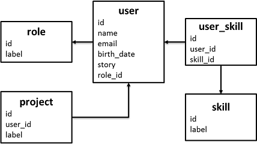
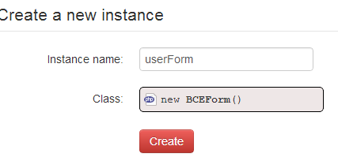
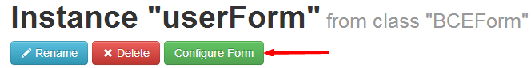
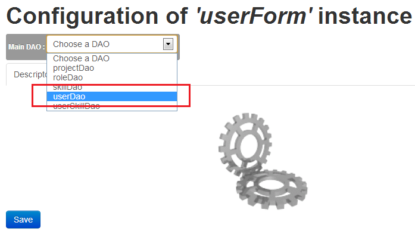
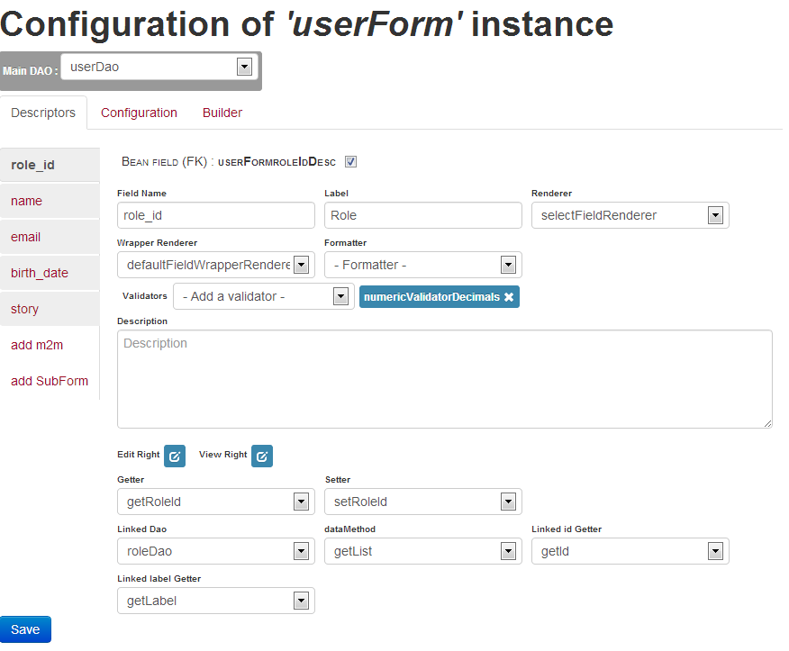
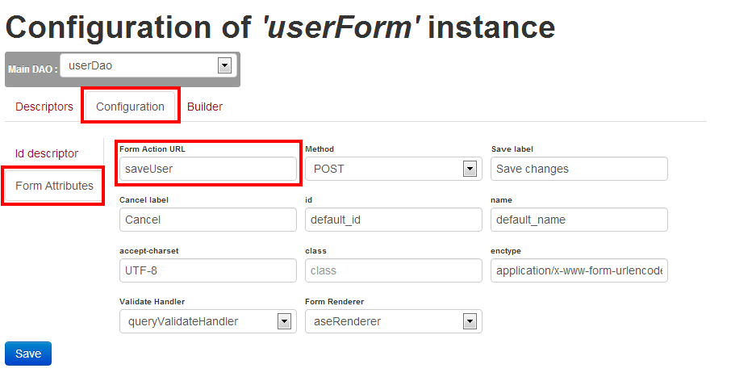
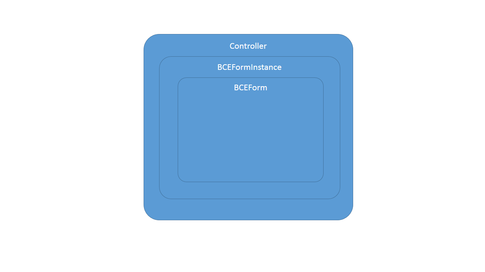
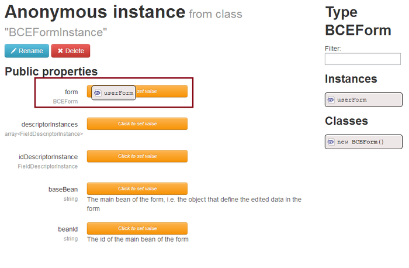
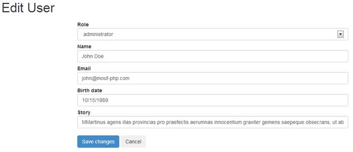

Quick Start Guide
==
In this quick start guide, we will see how you can use BCE to build a user form

Our playground data model
--
The first thing you have to know, is that BCE directy relies on your application's ORM system. For now, Mouf's ORM system is TDBM ((see documentatiopn here)[http://mouf-php.com/packages/mouf/database.tdbm/index.md]), but when others will be available, we will do our best to provide multi-ORM support. You will find a detailed description of BCE's architecture in the dedicated chapter [Detailed Architecture](detailed-architecture.html)



**Requirement** : BCE needs a specific TDBM setting. You must turn the defaultAutoSaveMode to false in the "tdbmService" instance (see [TDBM's DAOs section](http://mouf-php.com/packages/mouf/database.tdbm/doc/generating_daos.md))

##Create and configure the form instance
First thing you have to do is creating a BCEForm instance. The BCEForm class represents a form. This is done, as usual, by hiting the "create a new instance" item of the ribbon menu. For example, we create a userForm instance :



Once you've done this, you reach the usual instance interface of Mouf. As explained in the readme, a dedicated interface 
assists you in creating and configuring your form : press the "configure form" button just under the title of the 
instance page.



You will reach the configuration screen.
Now, as explained above, BCE relies on the ORM system. You will first have to choose the DAO that handles the main entity the form should manage, in our case, we will choose the UserDAO :



Once you choosed your DAO, the default form configuration will load automatically : each column of the `user` table will be mapped with a field descriptor (please read the  [Detailed Architecture](detailed-architecture.html) for more information on field descriptors).

In this exemple, we will leave everything to default.



Simply configure the form's action to submit to the *saveUser* URL. To do so, click Configuration >> Form Attributes, then modify the "Form Action URL" field



_**Note :** If the data model changes, and you add a column, it will be automatically detected and suggested. If you remove a column, you will have to remove the field descriptor manually_

##Write a simple controller & view

We will assume, you already now about Splash and its MVC implementation. If not, please refer to [Splash documentation](http://mouf-php.com/packages/mouf/mvc.splash/index.md) to understand what comes next.

Create a controller class (let's say the UserController), that has 2 actions: editUser and saveUser. Add a `userFormInstance` property of the `BCEFormInstance` class.

Note: the `BCEFormInstance` class represents a specific instance (with all the values) of a form, that is itself repsented by the `BCEForm` class.
Each `BCEFormInstance` instance refers to a particular `BCEForm`.




```php
    /**
     * @var BCEFormInstance
	 */
	public $formInstance;
	
	/**
	 * User edition page.
	 * @param string $id the user's id (null for creation)
	 * @URL editUser
	 */
	public function editUser($id = null) {
		$this->formInstance->load($id);
		
		$this->content->addFile(ROOT_PATH."src/views/user/edit-user.php", $this);
		$this->template->toHtml();
	}
	
	/**
	 * Save the user into DB.
	 * @URL saveUser
	 */
	public function saveUser() {
		$id = $this->formInstance->save();

		if ($id){
			set_user_message("User has been saved", UserMessageInterface::SUCCESS);
		}else{
			set_user_message("An error occured while saving the user", UserMessageInterface::ERROR);
		}
        
    	header("location:".ROOT_URL."editUser?id=".$id);
		return;
	}
```

create the view for displaying the form :
```php
<?php
use Test\Controllers\UserController;
/* @var $this UserController */
?>
<h1>Edit User</h1>
<?php 
$this->formInstance->toHtml();
```

Then, bind those instances together : the userController with the formInstance, and the userForm to the formInstance



## ENJOY !!
Refresh the cache for registering the new URLs, and goto the /editUser page (or editUser?id=1 for user edition)



## TROUBLESHOOTING
BCE is using Mouf's TDBM ORM. You will get a fatal error (PDO Exception) when trying to load a new object form because TDBM will try to save the bean by default.

To fix this, you will have to set the dbConnection instance's "defaultAutoSave" to false.

##Continue
Using very few lines of code, and less than 5 minutes in mouf's configuration interface we manaaged creating a simple form, that contains every field of the `user` table (note that the role field is a dropdown list of items of the `role` table, and the birth date field is already a datepiker without any further configuration).

But this was just the begining : the generated form is missing some fields (only the ones directly related to the `user` table are displayed)...

> Next Steps : 

> * In order to get a better understanding of the BCE library, you should read the ["Detailed Architecture"](detailed-architecture.md) chapter.
> * Or you might rather like to continue the overview of BCE capabilities, next chapter is ["Configuring BCE Forms"](configure-bce-forms.md) chapter.
